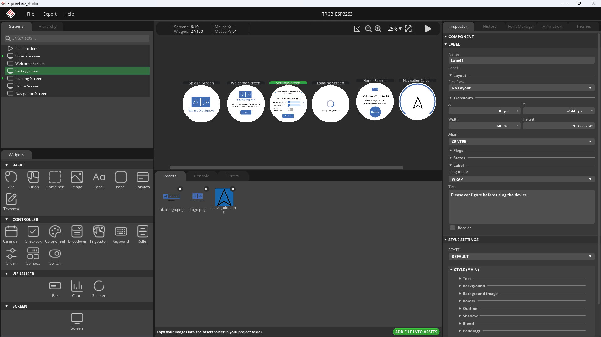

# TRGB Display

## UI Design

I use SquareLine Studio for Personal use version for building the UI design. This app is easy to use and save you a lot of time when your application have countless components.

Upon satisfied with your design, we can export the design to a folder. This process is mainly converting our design into callable source codes that can be used by the LVGL.

## To flash the firmware:

- Press the Boot Button and Reset consequently.
- Flash the image

## Libraries

* lvgl v.8.3.11.
* TRGBArduinoSupport@^0.0.4
